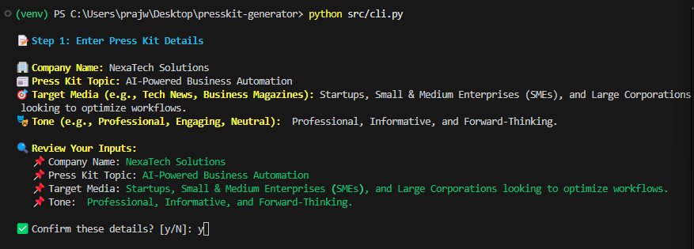
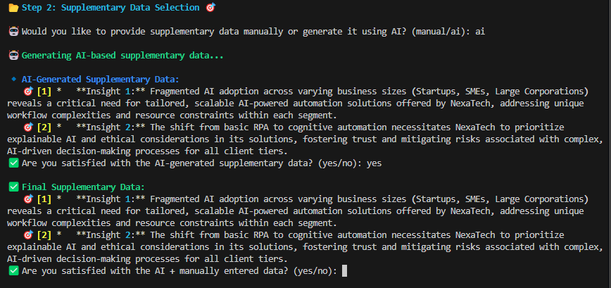
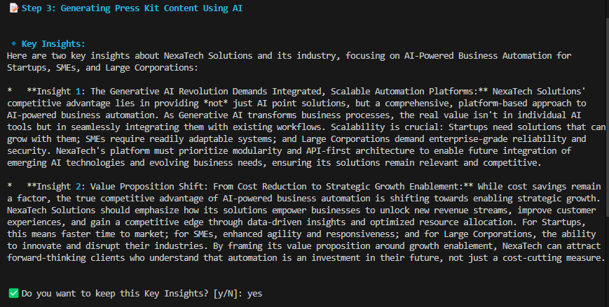
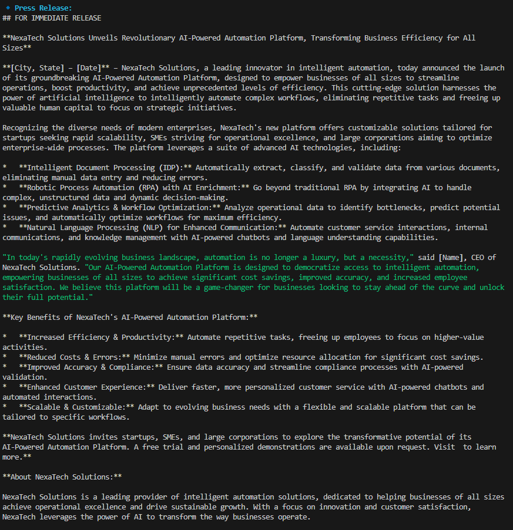
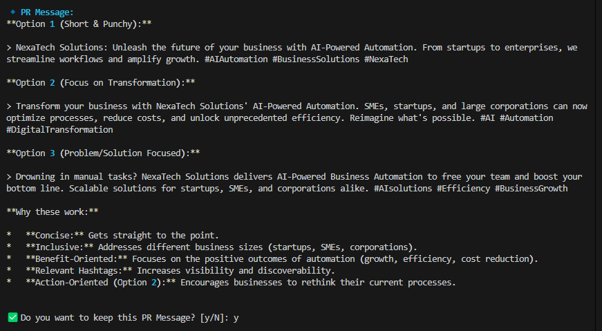
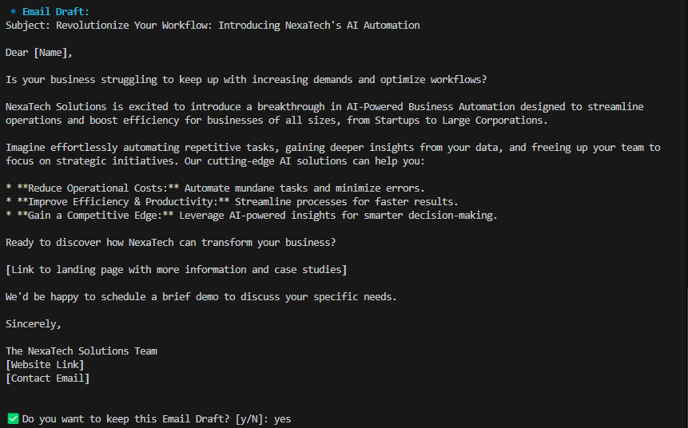
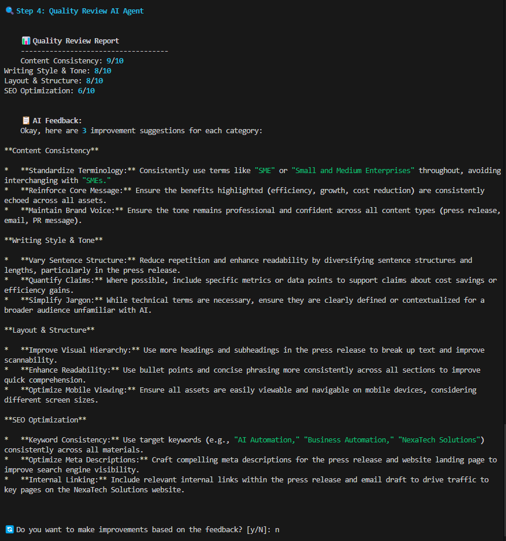
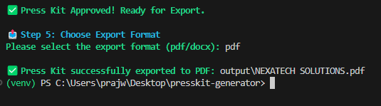

 
# Press Kit AI Generator

## Overview
Press Kit AI Generator is an AI-powered tool designed to help users create professional press kits effortlessly. This tool automates the process of generating media-ready press kits, including company details, executive bios, product descriptions, media assets, and more.

## Features
- **Automated Press Kit Generation**: AI-driven content creation for company details, media bios, and product information.
- **Media Asset Management**: Supports uploading and organizing images, logos, and other assets.
- **Export Options**: Download the press kit in PDF and DOCX.
- **AI-Powered Copywriting**: Enhances text with SEO-friendly and professional language.


## Installation
### Prerequisites
Ensure you have the following installed:
- Python

### Setting up Virtual Environment and Environment Variables
1. Create and activate a virtual environment:
   ```bash
   python -m venv venv
   source venv/bin/activate  # On macOS/Linux
   venv\Scripts\activate     # On Windows
   ```
2. Obtain an API key:
   - Sign up for an account at the API provider's website.
   - Navigate to the API key management section.
   - Generate a new API key and copy it.

3. Create a `.env` file in the project root and add necessary environment variables:
   ```bash
   touch .env
   ```
   Example `.env` file:
   ```ini
   GENAI_API_KEY=your-api-key-here
   ```

4. Install dependencies:
   ```bash
   pip install -r requirements.txt
   ```
5. Install Google-GeneAI:
   ```bash
   pip install -q -U google-genai
   ```

## Project Structure
```
> output
> src
   - __init__.py
   - cli.py
   - config.py
   > core
       - __init__.py
       - ai_generator.py
       - content_generator.py
       - data_selection.py
       - export.py
       - quality_review.py
       - user_input.py
  requirements.txt
  run.py
  setup.py
```

## Usage Guide: Step-by-Step Press Kit Generation

### 📝 Step 1: Enter Press Kit Details
Enter basic information about your press kit:
```bash
$ python src/cli.py --generate

Enter Company Name: NexaTech Solutions
Enter Press Kit Topic: AI-Powered Business Automation
Enter Target Media: Startups, SMEs, Large Corporations
Enter Desired Tone: Professional, Informative, Forward-Thinking
```



### 🎯 Step 2: Supplementary Data Selection
Choose your data input method:
```bash
$ python src/cli.py --select-data

Select data input method:
1. Manual Entry
2. AI-Generated
> 2

Generating supplementary insights based on topic...
```



### 📝 Step 3: Generating Press Kit Content Using AI
The AI generates content in multiple stages:
```bash
$ python src/cli.py --generate-content

Generating key insights...
```


```bash
Drafting press release...
```


```bash
Creating PR messages...
```


```bash
Preparing email templates...
```


### 📊 Step 4: Quality Review AI Agent
Run the AI quality check:
```bash
$ python src/cli.py --review

Analyzing content consistency...
Checking writing style...
Verifying tone alignment...
Generating improvement suggestions...
```



### 📤 Step 5: Choose Export Format
Export your completed press kit:
```bash
$ python src/cli.py --generate --format pdf

Generating PDF output...
Press Kit successfully exported to: output/NEXATECH_SOLUTIONS.pdf
```



# Final Output Preview:


## Contributing
1. Fork the repository
2. Create a feature branch (`git checkout -b feature-name`)
3. Commit changes (`git commit -m 'Add new feature'`)
4. Push to the branch (`git push origin feature-name`)
5. Open a Pull Request

## License
MIT License. See `LICENSE` for details.

## Contact
For support, contact [prajwalsontakke8468@gmail.com](mailto:prajwalsontakke8468@gmail.com).
